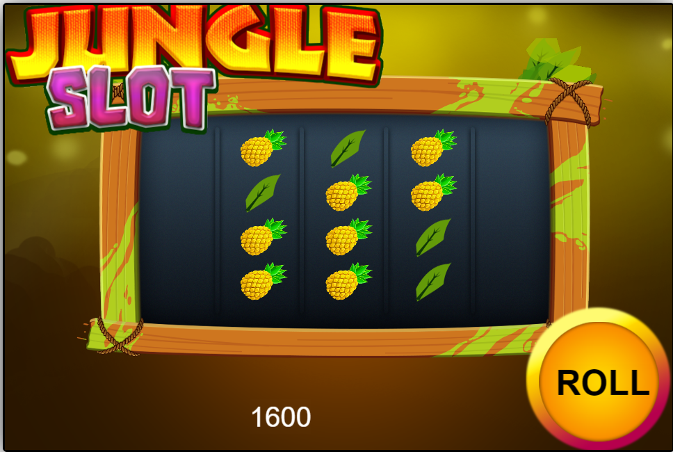

# JUNGLE SLOTS

[PLAY IT HERE](https://lufemas.github.io/jungle-slots-cocos/build/web-desktop/)

- A slot machine game prototype made with Cocos Creator and Typescript.
- You start the game with 200 points, each bet costs 20 points, and each aligned row prize is 100 points.

All assets were made by [danitorres567 and can be found at opengameart.org](https://opengameart.org/users/danitorres567)